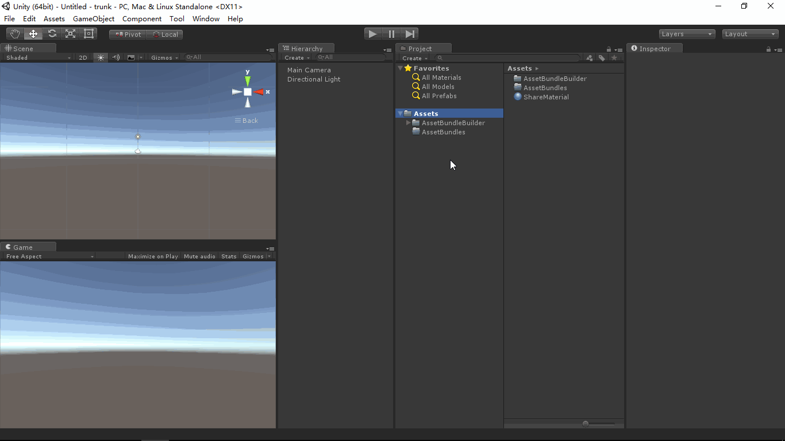

# AssetBundleBuilder
- [中文手册](./README_ZH.md)

## Summary
- Unity plugin for build AssetBundle.

## Demand
- Config build options and build AssetBundles to target path.

## Environment
- Unity 5.0 or above.
- .Net Framework 3.0 or above.

## Achieve
- AssetBundleBuilder : Draw extend editor window, config build options and build AssetBundles to target path.

## Preview
- AssetBundle Builder

## Contact
- If you have any questions, feel free to contact me at mogoson@outlook.com.
