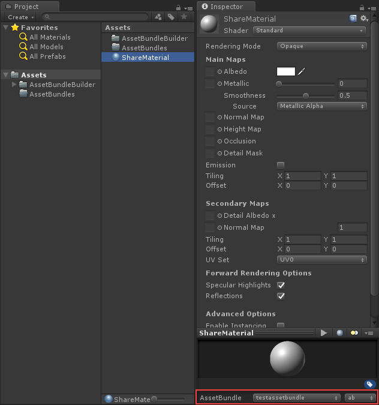
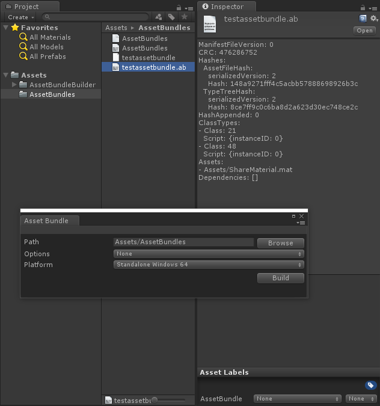

# AssetBundleBuilder
- [English Manual](./README.md)

## 概述
- Unity AssetBundle 创建器。

## 需求
- 配置 AssetBundle 创建参数选项。
- 创建 AssetBundle 到目标路径下。

## 环境
- Unity 5.0 或更高版本。
- .Net Framework 3.0 或更高版本。

## 实现
- AssetBundleBuilder：绘制扩展编辑器窗口，通过参数配置创建选项，创建所有AssetBundle，保存到目标路径。

## 使用
- 使用AssetBundle Menu（选中资源文件时，Unity的Inspector面板底部）将资源分配到AssetBundle。

- 使用AssetBundle Builder创建分配好的AssetBundle。

 

## 联系
- 如果你有任何问题或者建议，欢迎通过mogoson@qq.com联系我。